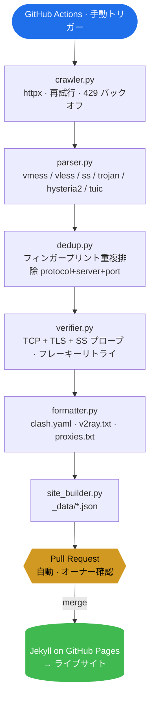

<div align="center">

# FreeNode

### 無料公開プロキシ購読ソース集約パイプライン + GitHub Pages ナビゲーションサイト

[](https://weed33834.github.io/freenode/)
[](LICENSE)
[](https://www.python.org/)
[](https://jekyllrb.com/)
[](https://docs.astral.sh/ruff/)
[](tests/)
[](https://weed33834.github.io/freenode/)

**🌐 サイト** · **📦 GitHub** · **📦 GitCode**

[English](README.md) | [中文](README.zh.md) | [日本語](README.ja.md)

</div>

---

## 概要

**FreeNode** は、80 以上のコミュニティ公開チャネルから無料公開プロキシ / ノード購読
ソースを集約し、重複排除と検証を行った上で、Clash / V2Ray / プロキシリストの 3 形式
で購読ファイルを出力し、GitHub Pages のナビゲーションサイトで公開するオープンソース
パイプラインです。

- **80+ データソース**：並行取得、信頼性に基づくスケジューリング
- **6 プロトコル**：`vmess` · `vless` · `ss` · `trojan` · `hysteria2` · `tuic`
- **2 段階検証**：TCP 接続 + プロトコルハンドシェイク（TLS / SS プローブ）
- **3 出力形式**：`clash.yaml` · `v2ray.txt` · `proxies.txt`
- **手動 PR ワークフロー**：ボットは `main` に直接コミットせず、毎回オーナーが承認
- **インフラ不要**：サーバー・DB・cron なし —— GitHub Actions + Pages のみ

> ⚠️ **免責事項**：本プロジェクトはネットワークプロトコルの学習、セキュリティテスト、
> プライバシー研究のみを目的とします。すべてのノードは第三者公開ソース由来であり、
> 当方が所有・運営・保証するものではありません。銀行・決済・機密ログインには使用
> しないでください。現地の法律を遵守してください。

## アーキテクチャ



<details>
<summary>ASCII 版（どこでもレンダリング可）</summary>

```
┌─────────────────────────────────────────────────────────────────────────┐
│                       GitHub Actions（手動）                            │
└─────────────────────────────────────────────────────────────────────────┘
                                   │
                                   ▼
        ┌──────────────┐    ┌──────────────┐    ┌──────────────┐
        │  crawler.py  │───▶│  parser.py   │───▶│   dedup.py   │
        │  httpx +     │    │  vmess/vless │    │  フィンガー  │
        │  再試行+429  │    │  ss/trojan/  │    │  プリント重複│
        └──────────────┘    │  hysteria2/  │    │  protocol+   │
                            │  tuic        │    │  server+port │
                            └──────────────┘    └──────┬───────┘
                                                       │
                                                       ▼
        ┌──────────────┐    ┌──────────────┐    ┌──────────────┐
        │ site_builder │◀───│ formatter.py │◀───│ verifier.py  │
        │   .py        │    │ clash.yaml   │    │ TCP + TLS +  │
        │ _data/*.json │    │ v2ray.txt    │    │ SS プローブ +│
        └──────┬───────┘    │ proxies.txt  │    │ フレーキー   │
               │            └──────────────┘    │ リトライ     │
               ▼                                └──────────────┘
    ┌──────────────────┐    ┌────────────────────────────┐
    │  Jekyll on Pages │    │  Pull Request（自動）      │
    │  → ライブサイト   │◀───│  オーナー確認 → マージ     │
    └──────────────────┘    └────────────────────────────┘
```

</details>

## クイックスタート

### ウェブサイトを使う

1. **<https://weed33834.github.io/freenode/>** を開く
2. 形式を選択（Clash / V2Ray / プロキシリスト）
3. **コピー** をクリックし、クライアントの購読欄に貼り付け

### ローカルでパイプラインを実行

```bash
# 1. 依存関係をインストール
pip install -r requirements.txt

# 2. フルパイプラインを実行（検証付き）
python scripts/update.py --verify

# 3. サイトデータを再生成
python scripts/site_builder.py

# 4. ローカルプレビュー
cd docs && jekyll serve --livereload
```

### GitHub Actions でデータを更新

1. **Actions → Manual Update & PR → Run workflow** へ
2. 検証レベルを選択（`tcp` or `protocol`）
3. ワークフローが `auto/pending-update` ブランチに PR を作成（`main` に直接 push しない）
4. オーナー確認 → **マージ** → Pages 自動デプロイ

> 🔒 **ボット対策保護**：`CODEOWNERS` がオーナー確認を強制、固定ブランチ名でブランチ
> 増殖を防止、7 日間未処理の古い PR は自動クローズ。

## プロジェクト構成

```
freenode/
├── config/sources.json        # 80+ データソース定義
├── scripts/
│   ├── crawler.py             # 並行取得器（httpx、再試行、429 バックオフ）
│   ├── parser.py              # プロトコルリンク解析（6 プロトコル）
│   ├── dedup.py               # フィンガープリントによる重複排除
│   ├── verifier.py            # TCP + プロトコルハンドシェイク検証
│   ├── formatter.py           # clash.yaml / v2ray.txt / proxies.txt 出力
│   ├── site_builder.py        # Jekyll _data/*.json 生成
│   ├── update.py              # パイプライン統合（CLI エントリポイント）
│   └── check_secrets.sh       # push 前の秘密鍵漏洩スキャン
├── docs/                      # Jekyll GitHub Pages サイト
│   ├── _config.yml            # Jekyll 設定
│   ├── _layouts/default.html   # サイバーパンクテーマレイアウト
│   ├── _includes/             # 再利用可能コンポーネント
│   ├── _data/                 # 自動生成 JSON（サイトデータ）
│   ├── assets/css/style.css  # サイバーパンクデザインシステム
│   ├── assets/js/main.js     # 検索、CountUp、ハンバーガーメニュー、QR
│   └── assets/js/qr.js       # 依存ライブラリ不要の QR 生成器（約 6KB）
├── nodes/                     # 出力購読ファイル
│   ├── clash.yaml
│   ├── v2ray.txt
│   ├── proxies.txt
│   └── quality.json          # 検証統計
├── tests/                     # 171 個の合格テスト（pytest）
├── .github/
│   ├── workflows/daily-update.yml  # 手動トリガーワークフロー
│   ├── CODEOWNERS             # オーナー確認を強制
│   ├── FUNDING.yml            # スポンサー設定
│   ├── ISSUE_TEMPLATE/        # Bug / feature テンプレート
│   └── PULL_REQUEST_TEMPLATE.md
├── CHANGELOG.md               # Keep a Changelog 形式
├── CONTRIBUTING.md            # コントリビューションガイド
├── CODE_OF_CONDUCT.md         # コミュニティ行動規範
├── SECURITY.md                # 脆弱性報告
└── LICENSE                    # MIT
```

## 設定

すべてのしきい値は環境変数で設定可能（デフォルト値如下）：

| 変数 | デフォルト | 説明 |
|---|---|---|
| `FREENODE_MAX_NODES` | `800` | 出力最大ノード数 |
| `FREENODE_MAX_PROXIES` | `300` | 出力最大プロキシ数 |
| `FREENODE_VERIFY_NODES` | `true` | 検証ステップを実行 |
| `FREENODE_VERIFY_LEVEL` | `tcp` | `tcp` or `protocol` |
| `FREENODE_VERIFY_TIMEOUT` | `5` | ノード接続タイムアウト（秒）|
| `FREENODE_VERIFY_WORKERS` | `50` | 並行検証数 |
| `FREENODE_VERIFY_CAP` | `0` | 検証前の事前切り詰め（0 = 無効）|
| `FREENODE_VERIFY_RETRIES` | `2` | フレーキー失敗の再試行回数 |
| `FREENODE_ARCHIVE_RETENTION` | `30` | スナップショット保持日数（0 = 無効）|
| `FREENODE_SUSPICIOUS_NETS` | — | カンマ区切り CIDR ブラックリスト（ハニーポット / Tor）|
| `FREENODE_GEO_ENABLED` | `false` | IP 地理位置情報ルックアップを有効化 |

## データソース

80 以上のソースはすべてコミュニティ公開チャネル（GitHub raw ファイル、購読エンド
ポイント、Telegram チャネル）です。新規ソースは**観察モード**（`status=observing`）
に入り、3 日連続で `reliability > 70%` を維持すると `active` に昇格します。7 日連続
で 30% 未満の場合は観察モードに降格します。詳細は公開[ソース一覧](https://weed33834.github.io/freenode/sources.html)を参照してください。

## ドキュメント

- 📖 [プロジェクトについて](https://weed33834.github.io/freenode/about.html)
- 📡 [ソース一覧](https://weed33834.github.io/freenode/sources.html)
- 🛠️ [プロトコル & クライアントガイド](https://weed33834.github.io/freenode/guides.html)
- 🔒 [セキュリティポリシー](SECURITY.md)
- 🤝 [コントリビューション](CONTRIBUTING.md)
- 📋 [変更履歴](CHANGELOG.md)

## 対応プロトコル

| プロトコル | 説明 |
|---|---|
| `vmess` | V2Ray VMess、AES/GCM 暗号化 |
| `vless` | V2Ray VLESS、軽量 XTLS |
| `ss` | Shadowsocks、AEAD 暗号 |
| `trojan` | Trojan-GFW、TLS 偽装 |
| `hysteria2` | Hysteria2、QUIC ベース |
| `tuic` | TUIC v5、QUIC ベース |

## 開発

```bash
make install     # 依存関係インストール
make test        # 171 テスト実行
make lint        # ruff チェック（すべて合格）
make check       # lint + test（push 前に実行）
make secrets     # 秘密鍵漏洩スキャン
make update      # パイプライン実行
```

## ライセンス

[MIT](LICENSE) © 2026 badhope

## リンク

- 🌐 **サイト**：<https://weed33834.github.io/freenode/>
- 📦 **GitHub**：<https://github.com/weed33834/freenode>
- 📦 **GitCode**：<https://gitcode.com/badhope/freenode>
- 📋 **Issues**：<https://github.com/weed33834/freenode/issues>
- 🔒 **セキュリティ**：<https://github.com/weed33834/freenode/security/advisories/new>

## Star History

FreeNode が役に立つ場合、GitHub で star を付けると他の人がプロジェクトを見つけやすく
なり、継続メンテナンスへの需要を示すことができます。
