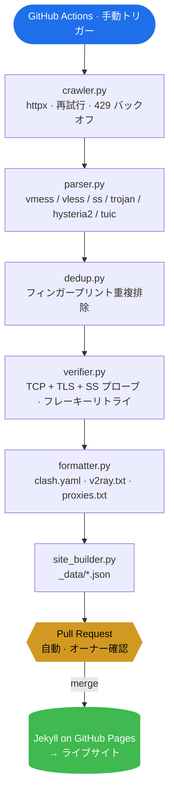

<div align="center">

# FreeNode

### 無料公開プロキシ購読ソース統合ナビゲーション

[](https://weed33834.github.io/freenode/)
[](LICENSE)
[](https://www.python.org/)
[](https://docs.astral.sh/ruff/)
[](tests/)

[English](README.md) · [简体中文](README.zh-CN.md) · [日本語](README.ja.md)

</div>

---

## 概要

**FreeNode** は、80以上のコミュニティ公開チャネルから無料公開プロキシ / ノード
購読ソースを集約・重複排除・検証し、Clash / V2Ray / プロキシリストの 3 形式で
出力するオープンソースパイプラインです。GitHub Pages でナビゲーションサイトを提供します。

- **80+ データソース**：並行取得、信頼性ベースのスケジューリング
- **6 プロトコル**：`vmess` · `vless` · `ss` · `trojan` · `hysteria2` · `tuic`
- **2 段階検証**：TCP 接続 + プロトコルハンドシェイク（TLS / SS probe）
- **3 出力形式**：`clash.yaml` · `v2ray.txt` · `proxies.txt`
- **手動 PR ワークフロー**：ボットは main に直接コミットしない、毎回オーナー承認
- **インフラ不要**：サーバー・DB・cron なし —— GitHub Actions + Pages のみ

> ⚠️ **免責事項**：本プロジェクトはネットワークプロトコル学習、セキュリティテスト、
> プライバシー研究のみを目的とします。すべてのノードは第三者公開ソース由来で、
> 当方は所有・運営・保証しません。銀行・決済・機密ログインに使用しないでください。
> 現地の法律を遵守してください。

## アーキテクチャ



<details>
<summary>ASCII 版（どこでもレンダリング可）</summary>

```
GitHub Actions (手動トリガー)
        │
        ▼
crawler → parser → dedup → verifier → formatter → site_builder
   │                                                  │
   └─ httpx + 再試行 + 429 バックオフ      _data/*.json → Jekyll → サイト
```

</details>

## クイックスタート

### ウェブサイトを使う

1. **<https://weed33834.github.io/freenode/>** を開く
2. 形式を選択（Clash / V2Ray / プロキシリスト）
3. **コピー** をクリック、クライアントの購読に貼り付け

### ローカルでパイプラインを実行

```bash
pip install -r requirements.txt
python scripts/update.py --verify    # フルパイプライン（検証付き）
python scripts/site_builder.py       # サイトデータ生成
cd docs && jekyll serve --livereload # ローカルプレビュー
```

### GitHub Actions でデータ更新

1. **Actions → Manual Update & PR → Run workflow** へ
2. 検証レベルを選択（`tcp` or `protocol`）
3. ワークフローが PR を `auto/pending-update` に作成（main に直接 push しない）
4. オーナー確認 → **マージ** → Pages 自動デプロイ

## 設定

しきい値は環境変数で設定可能：

| 変数 | デフォルト | 説明 |
|---|---|---|
| `FREENODE_MAX_NODES` | `800` | 最大ノード数 |
| `FREENODE_MAX_PROXIES` | `300` | 最大プロキシ数 |
| `FREENODE_VERIFY_NODES` | `true` | 検証を実行 |
| `FREENODE_VERIFY_LEVEL` | `tcp` | `tcp` or `protocol` |
| `FREENODE_VERIFY_TIMEOUT` | `5` | 接続タイムアウト（秒）|
| `FREENODE_VERIFY_WORKERS` | `50` | 並行検証数 |
| `FREENODE_VERIFY_RETRIES` | `2` | フレーキーリトライ回数 |

## ドキュメント

- 📖 [プロジェクトについて](https://weed33834.github.io/freenode/about.html)
- 📡 [ソース一覧](https://weed33834.github.io/freenode/sources.html)
- 🛠️ [プロトコル & クライアントガイド](https://weed33834.github.io/freenode/guides.html)
- 🔒 [セキュリティポリシー](SECURITY.md)
- 🤝 [コントリビューション](CONTRIBUTING.md)
- 📋 [変更履歴](CHANGELOG.md)

## 開発

```bash
make install     # 依存関係インストール
make test        # 171 テスト実行
make lint        # ruff チェック（すべて合格）
make check       # lint + test（push 前に実行）
make secrets     # 秘密鍵漏洩スキャン
```

## ライセンス

[MIT](LICENSE) © 2026 badhope

## リンク

- 🌐 **サイト**：<https://weed33834.github.io/freenode/>
- 📦 **GitHub**：<https://github.com/weed33834/freenode>
- 📦 **GitCode**：<https://gitcode.com/badhope/freenode>
- 📋 **Issues**：<https://github.com/weed33834/freenode/issues>
