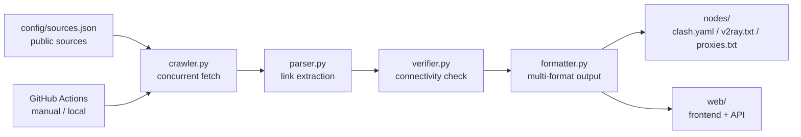

# FreeNode

> A community-maintained aggregator of public proxy and node lists. For learning and research only.

[](https://github.com/MS33834/freenode/actions/workflows/update-nodes.yml)
[](https://github.com/MS33834/freenode/actions/workflows/deploy-docs.yml)
[](https://github.com/MS33834/freenode/actions/workflows/ci.yml)
[](https://github.com/MS33834/freenode/actions/workflows/codeql.yml)
[](LICENSE)
[](VERSION)

**English** | [简体中文](README.zh-CN.md)

---

## Disclaimer

1. This project is for network protocol learning, security testing, and privacy research only.
2. All nodes and proxies come from public sources. We do not guarantee their availability, security, or privacy.
3. Never log into sensitive accounts (banking, payments, social media) over free proxies.
4. Follow the laws of your country or region.
5. Maintainers are not liable for any direct or indirect damages from using this project.

---

## What is FreeNode?

FreeNode runs a pipeline that fetches public proxy and node lists from the internet, parses them, optionally verifies connectivity, and writes out subscription files in three formats: Clash YAML, V2Ray, and a plain HTTP(S)/SOCKS4/SOCKS5 proxy list. The pipeline runs on demand — locally via `scripts/update.py`, via the backend scheduler after deployment, or by manually triggering the `Update Nodes` workflow.

The project itself **does not operate any proxy or VPN servers**. It only aggregates, parses, and reformats publicly available resources. All sources, scripts, and configs are open for community audit and contribution.

---

## Quick Start

### 1. Subscribe to the daily output

| Format | GitHub Raw | GitCode Raw |
|---|---|---|
| Clash | `https://raw.githubusercontent.com/MS33834/freenode/main/nodes/clash.yaml` | `https://api.gitcode.com/api/v5/repos/badhope/freenode/raw/nodes/clash.yaml?ref=main` |
| V2Ray | `https://raw.githubusercontent.com/MS33834/freenode/main/nodes/v2ray.txt` | `https://api.gitcode.com/api/v5/repos/badhope/freenode/raw/nodes/v2ray.txt?ref=main` |
| HTTP(S)/SOCKS4/SOCKS5 | `https://raw.githubusercontent.com/MS33834/freenode/main/nodes/proxies.txt` | `https://api.gitcode.com/api/v5/repos/badhope/freenode/raw/nodes/proxies.txt?ref=main` |

Copy a link into your client's subscription URL field and it will pull the daily-updated list.

### 2. Run it locally

```bash
git clone https://github.com/MS33834/freenode.git
cd freenode
pip3 install -r requirements.txt -r backend/requirements.txt
make test              # run unit tests
python3 scripts/update.py
```

With node verification (slower, filters dead nodes):

```bash
FREENODE_VERIFY_NODES=true python3 scripts/update.py --verify
```

With GeoIP region grouping:

```bash
FREENODE_GEO_ENABLED=true python3 scripts/update.py
```

### 3. Run the web app

The `web/` directory is a Next.js app served together with `backend/`'s FastAPI. Local preview:

```bash
cd backend && uvicorn app.main:app --reload   # API on :8000
cd web && npm run dev                          # frontend proxies /api to backend
```

Production deployment uses `backend/docker-compose.yml` (Caddy auto-HTTPS, reverse-proxying Next.js and `/api`):

```bash
cd backend && docker compose up -d
```

---

## How it works



1. `crawler.py` reads `config/sources.json` and fetches sources concurrently.
2. `parser.py` extracts `ss://`, `vmess://`, `vless://`, `trojan://`, `hysteria://`, `hysteria2://`, `tuic://`, and `http(s)://`, `socks4://`, `socks5://` links.
3. `verifier.py` does a lightweight TCP connect + latency test (when enabled).
4. `formatter.py` writes Clash, V2Ray, and HTTP(S)/SOCKS4/SOCKS5 outputs, plus an optional regions.json.
5. The pipeline is run on demand (locally via `scripts/update.py`, the backend scheduler, or a manual `Update Nodes` workflow run) and the regenerated `nodes/` is pushed to GitHub; GitCode mirrors the same content.

---

## Output files

Files in `nodes/` are regenerated by the pipeline each day:

| File | Format | Use |
|---|---|---|
| `clash.yaml` | Clash / Clash Verge / Stash | Multi-protocol Clash config |
| `v2ray.txt` | V2Ray / Nekoray / v2rayN / v2rayNG | One share link per line |
| `proxies.txt` | HTTP(S)/SOCKS4/SOCKS5 | One `host:port` per line |
| `regions.json` | JSON | Node counts by protocol and region |

Public nodes are short-lived by nature. Subscribe via the raw URLs rather than copying file contents.

---

## Configuration

Pipeline behavior is controlled via environment variables. Copy `.env.example` to `.env` and adjust.

| Variable | Default | Description |
|---|---|---|
| `FREENODE_VERIFY_NODES` | `true` | Enable TCP connectivity check during update |
| `FREENODE_MAX_NODES` | `800` | Max node links kept in output |
| `FREENODE_MAX_PROXIES` | `300` | Max HTTP(S)/SOCKS4/SOCKS5 proxies kept |
| `FREENODE_CRAWL_WORKERS` | `16` | Concurrent source fetches |
| `FREENODE_VERIFY_TIMEOUT` | `5` | Per-node TCP connect timeout (seconds) |
| `FREENODE_VERIFY_WORKERS` | `50` | Concurrent verification threads |
| `FREENODE_GEO_ENABLED` | `false` | Enable GeoIP region grouping |
| `FREENODE_ALLOWED_HOSTS` | `raw.githubusercontent.com,gitcode.com,api.gitcode.com` | SSRF allowlist for crawler |

Backend API config lives in `backend/.env.example`.

---

## Project structure

```text
FreeNode/
├── .github/              # Issue/PR templates, Actions workflows, governance
├── config/
│   └── sources.json      # public data source config
├── docs-site/            # VitePress documentation site (GitHub Pages)
├── nodes/                # auto-generated output files
├── scripts/              # pipeline: crawler / parser / verifier / formatter / update
├── tests/                # pipeline unit tests
├── backend/              # FastAPI service (API, DB, scheduler)
│   └── tests/            # backend unit tests
├── web/                  # Next.js frontend (server-rendered)
├── landing/              # static landing page (GitHub Pages root)
├── tools/                # per-platform client recommendations
├── Makefile              # common dev commands
├── pyproject.toml        # ruff / pytest / coverage / mypy config
├── requirements.txt      # Python deps
├── CHANGELOG.md
├── CONTRIBUTING.md
├── SECURITY.md
├── SUPPORT.md
├── CODE_OF_CONDUCT.md
├── AUTHORS.md
├── DEVELOPMENT.md
└── LICENSE
```

---

## Documentation

**In-repo (English):**

- [Deployment guide](DEPLOYMENT.md) — self-host the full stack with Docker Compose
- [Configuration reference](CONFIGURATION.md) — every env variable and sources.json schema
- [Development guide](DEVELOPMENT.md) — local setup, project structure, testing
- [Contributing](CONTRIBUTING.md) — bug reports, data sources, code PRs
- [Security policy](SECURITY.md) — vulnerability reporting
- [Changelog](CHANGELOG.md)

**Docs site (中文, VitePress):** <https://ms33834.github.io/freenode/docs/>

- [新手指南](https://ms33834.github.io/freenode/docs/beginner-guide)
- [客户端配置](https://ms33834.github.io/freenode/docs/client-setup/clash-verge-rev) (Clash Verge Rev, v2rayN, v2rayNG, Shadowrocket)
- [数据源说明](https://ms33834.github.io/freenode/docs/data-sources)
- [项目架构](https://ms33834.github.io/freenode/docs/architecture)
- [安全与合规](https://ms33834.github.io/freenode/docs/security)
- [部署说明](https://ms33834.github.io/freenode/docs/deployment)
- [常见问题](https://ms33834.github.io/freenode/docs/faq)

---

## Contributing

Contributions are welcome — bug fixes, new public data sources, docs improvements, client tutorials.

- Report a dead source: use the [source report](https://github.com/MS33834/freenode/issues/new?template=source_report.md) template.
- Add a data source: read [docs-site/data-source-guide.md](docs-site/data-source-guide.md) first.
- Improve code or docs: fork → branch → PR, ensure `make test` and `make lint` pass.
- Security issues: follow [SECURITY.md](SECURITY.md). Do not disclose in public issues.

See [CONTRIBUTING.md](CONTRIBUTING.md) and [CODE_OF_CONDUCT.md](CODE_OF_CONDUCT.md) for the full guide.

---

## Useful links

- **Landing page**: <https://ms33834.github.io/freenode/>
- **Docs site**: <https://ms33834.github.io/freenode/docs/>
- **GitHub Issues**: <https://github.com/MS33834/freenode/issues>
- **GitCode mirror**: <https://gitcode.com/badhope/freenode>

---

## Star history

If this project helps you, a star helps others find it.

[](https://star-history.com/#MS33834/freenode&Date)

---

## License

[CNCL](LICENSE). FreeNode doesn't own or operate any of the aggregated sources — credit goes to the community maintainers listed in `config/sources.json`.
