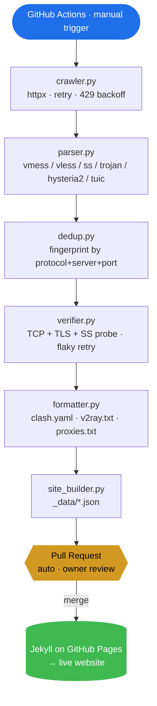

<div align="center">

# FreeNode

### Free Public Proxy Subscription Aggregator with GitHub Pages Navigation Site

[](https://weed33834.github.io/freenode/)
[](LICENSE)
[](https://www.python.org/)
[](https://jekyllrb.com/)
[](https://docs.astral.sh/ruff/)
[](tests/)
[](https://weed33834.github.io/freenode/)

**🌐 Website** · **📦 GitHub** · **📦 GitCode**

[English](README.md) · [简体中文](README.zh-CN.md) · [日本語](README.ja.md)

</div>

---

## Overview

**FreeNode** is an open-source pipeline that aggregates free public proxy / node
subscription sources from 80+ community channels, deduplicates and verifies them,
then publishes ready-to-use subscription files (Clash / V2Ray / plain proxy list)
behind a fast GitHub Pages navigation site.

- **80+ sources** crawled in parallel with reliability-aware scheduling
- **6 protocols** parsed: `vmess` · `vless` · `ss` · `trojan` · `hysteria2` · `tuic`
- **Two-stage verification**: TCP connect + protocol handshake (TLS / SS probe)
- **Three output formats**: `clash.yaml` · `v2ray.txt` · `proxies.txt`
- **Manual PR workflow**: no bot commits to `main`, every update is owner-reviewed
- **Zero infrastructure**: no server, no database, no cron — pure GitHub Actions + Pages

> ⚠️ **Disclaimer**: This project is for network protocol learning, security
> testing and privacy research only. All nodes come from third-party public
> sources; we do not own, operate or guarantee them. Do not use for banking,
> payments or any sensitive login. Follow your local laws.

## Architecture



<details>
<summary>ASCII version (renders everywhere)</summary>

```
┌─────────────────────────────────────────────────────────────────────────┐
│                         GitHub Actions (manual)                         │
└─────────────────────────────────────────────────────────────────────────┘
                                   │
                                   ▼
        ┌──────────────┐    ┌──────────────┐    ┌──────────────┐
        │  crawler.py  │───▶│  parser.py   │───▶│   dedup.py   │
        │  httpx +     │    │  vmess/vless  │    │ fingerprint  │
        │  retry+429   │    │  ss/trojan/   │    │ dedup by     │
        └──────────────┘    │  hysteria2/tuic│    │ protocol+    │
                            └──────────────┘    │ server+port  │
                                                └──────┬───────┘
                                                       │
                                                       ▼
        ┌──────────────┐    ┌──────────────┐    ┌──────────────┐
        │ site_builder │◀───│ formatter.py │◀───│ verifier.py  │
        │   .py        │    │ clash.yaml    │    │ TCP + TLS +  │
        │ _data/*.json │    │ v2ray.txt     │    │ SS probe +   │
        └──────┬───────┘    │ proxies.txt   │    │ flaky retry  │
               │            └──────────────┘    └──────────────┘
               ▼
    ┌──────────────────┐    ┌────────────────────────────┐
    │  Jekyll on Pages │    │  Pull Request (auto)       │
    │  → live website   │◀───│  owner review → merge      │
    └──────────────────┘    └────────────────────────────┘
```

</details>

## Quick Start

### Use the website

1. Open **<https://weed33834.github.io/freenode/>**
2. Pick a format (Clash / V2Ray / proxy list)
3. Click **Copy** and paste the subscription URL into your client

### Run the pipeline locally

```bash
# 1. Install dependencies
pip install -r requirements.txt

# 2. Run the full pipeline with verification
python scripts/update.py --verify

# 3. Regenerate site data
python scripts/site_builder.py

# 4. Preview locally
cd docs && jekyll serve --livereload
```

### Update data via GitHub Actions

1. Go to **Actions → Manual Update & PR → Run workflow**
2. Choose verify level (`tcp` or `protocol`)
3. The workflow creates a PR to `auto/pending-update` (never pushes to `main`)
4. Owner reviews → **Merge** → Pages auto-deploys

> 🔒 **Anti-bot protection**: `CODEOWNERS` enforces owner review, fixed branch
> name prevents branch sprawl, stale PRs auto-close after 7 days.

## Project Structure

```
freenode/
├── config/sources.json        # 80+ data source definitions
├── scripts/
│   ├── crawler.py             # Parallel fetcher (httpx, retry, 429 backoff)
│   ├── parser.py              # Protocol link parser (6 protocols)
│   ├── dedup.py               # Fingerprint-based deduplication
│   ├── verifier.py            # TCP + protocol handshake verification
│   ├── formatter.py           # Output to clash.yaml / v2ray.txt / proxies.txt
│   ├── site_builder.py        # Generate Jekyll _data/*.json
│   ├── update.py              # Pipeline orchestrator (CLI entrypoint)
│   └── check_secrets.sh       # Pre-push secret leak scanner
├── docs/                      # Jekyll GitHub Pages site
│   ├── _config.yml            # Jekyll config
│   ├── _layouts/default.html   # Cyberpunk-themed layout
│   ├── _includes/             # Reusable components
│   ├── _data/                # Auto-generated JSON (site data)
│   ├── assets/css/style.css  # Cyberpunk design system
│   ├── assets/js/main.js     # Search, CountUp, hamburger menu, QR
│   └── assets/js/qr.js       # Dependency-free QR generator (~6KB)
├── nodes/                     # Output subscription files
│   ├── clash.yaml
│   ├── v2ray.txt
│   ├── proxies.txt
│   └── quality.json          # Verification stats
├── tests/                     # 171 passing tests (pytest)
├── .github/
│   ├── workflows/daily-update.yml  # Manual-trigger workflow
│   ├── CODEOWNERS             # Enforces owner review
│   ├── FUNDING.yml            # Sponsorship config
│   ├── ISSUE_TEMPLATE/        # Bug/feature templates
│   └── PULL_REQUEST_TEMPLATE.md
├── CHANGELOG.md               # Keep a Changelog format
├── CONTRIBUTING.md            # Contribution guidelines
├── CODE_OF_CONDUCT.md         # Community code of conduct
├── SECURITY.md                # Vulnerability reporting
└── LICENSE                    # MIT
```

## Configuration

All thresholds are configurable via environment variables (defaults shown):

| Variable | Default | Description |
|---|---|---|
| `FREENODE_MAX_NODES` | `800` | Max nodes in output |
| `FREENODE_MAX_PROXIES` | `300` | Max proxies in output |
| `FREENODE_VERIFY_NODES` | `true` | Run verification step |
| `FREENODE_VERIFY_LEVEL` | `tcp` | `tcp` or `protocol` |
| `FREENODE_VERIFY_TIMEOUT` | `5` | Per-node connect timeout (s) |
| `FREENODE_VERIFY_WORKERS` | `50` | Concurrent verifiers |
| `FREENODE_VERIFY_CAP` | `0` | Truncate before verify (0 = off) |
| `FREENODE_VERIFY_RETRIES` | `2` | Retry flaky failures (timeout/network) |
| `FREENODE_ARCHIVE_RETENTION` | `30` | Days to keep snapshots (0 = off) |
| `FREENODE_SUSPICIOUS_NETS` | — | Comma-sep CIDR blacklist (honeypots/Tor) |
| `FREENODE_GEO_ENABLED` | `false` | Enable IP geolocation lookup |

## Data Sources

All 80+ sources are community public channels (GitHub raw files, subscription
endpoints, Telegram channels). New sources enter **observation mode**
(`status=observing`) and must sustain `reliability > 70%` for 3 consecutive
days before being promoted to `active`. Sources below 30% for 7 days are
demoted back to observation. See the live [Sources Directory](https://weed33834.github.io/freenode/sources.html).

## Documentation

- 📖 [About the project](https://weed33834.github.io/freenode/about.html)
- 📡 [Sources directory](https://weed33834.github.io/freenode/sources.html)
- 🛠️ [Protocol & client guide](https://weed33834.github.io/freenode/guides.html)
- 🔒 [Security policy](SECURITY.md)
- 🤝 [Contributing](CONTRIBUTING.md)
- 📋 [Changelog](CHANGELOG.md)

## Supported Protocols

| Protocol | Description |
|---|---|
| `vmess` | V2Ray VMess, AES/GCM encryption |
| `vless` | V2Ray VLESS, lightweight XTLS |
| `ss` | Shadowsocks, AEAD ciphers |
| `trojan` | Trojan-GFW, TLS camouflaged |
| `hysteria2` | Hysteria2, QUIC-based |
| `tuic` | TUIC v5, QUIC-based |

## Development

```bash
make install     # install dependencies
make test        # run 171 tests
make lint        # ruff check (all green)
make check       # lint + test (run before push)
make secrets     # scan for leaked secrets
make update      # run pipeline
```

## License

[MIT](LICENSE) © 2026 badhope

## Links

- 🌐 **Website**: <https://weed33834.github.io/freenode/>
- 📦 **GitHub**: <https://github.com/weed33834/freenode>
- 📦 **GitCode**: <https://gitcode.com/badhope/freenode>
- 📋 **Issues**: <https://github.com/weed33834/freenode/issues>
- 🔒 **Security**: <https://github.com/weed33834/freenode/security/advisories/new>

## Star History

If this project helps you, please consider giving it a ⭐ on GitHub — it helps
others discover FreeNode and keeps the project maintained.
