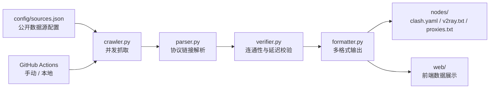

# FreeNode

> 一个社区维护的免费代理与公开节点聚合器，仅供学习与技术研究。

[](https://github.com/MS33834/freenode/actions/workflows/update-nodes.yml)
[](https://github.com/MS33834/freenode/actions/workflows/deploy-docs.yml)
[](https://github.com/MS33834/freenode/actions/workflows/ci.yml)
[](https://github.com/MS33834/freenode/actions/workflows/codeql.yml)
[](LICENSE)
[](VERSION)

[English](README.md) | **简体中文**

---

## 免责声明

1. 本项目仅用于网络协议学习、安全测试和隐私技术研究。
2. 所有节点与代理均来自公开渠道，我们不保证其可用性、安全性或隐私性。
3. 使用免费代理/节点时，不要登录敏感账户（银行、支付、社交媒体等）。
4. 请遵守所在国家或地区的法律法规。
5. 维护者不对因使用本项目而产生的任何直接或间接损失负责。

---

## 项目简介

**FreeNode** 通过自动化流水线聚合互联网上的免费代理和公开节点订阅，生成多种客户端可消费的订阅格式，并提供静态站点与 VitePress 文档。

项目本身**不运营任何代理或 VPN 节点**，只对公开资源做聚合、解析与格式转换。所有数据源、脚本和配置完全开源，欢迎社区审计与贡献。

---

## 快速开始

### 1. 直接订阅每日节点

| 格式 | GitHub Raw | GitCode Raw |
|---|---|---|
| Clash | `https://raw.githubusercontent.com/MS33834/freenode/main/nodes/clash.yaml` | `https://api.gitcode.com/api/v5/repos/badhope/freenode/raw/nodes/clash.yaml?ref=main` |
| V2Ray | `https://raw.githubusercontent.com/MS33834/freenode/main/nodes/v2ray.txt` | `https://api.gitcode.com/api/v5/repos/badhope/freenode/raw/nodes/v2ray.txt?ref=main` |
| HTTP(S)/SOCKS4/SOCKS5 | `https://raw.githubusercontent.com/MS33834/freenode/main/nodes/proxies.txt` | `https://api.gitcode.com/api/v5/repos/badhope/freenode/raw/nodes/proxies.txt?ref=main` |

将对应链接复制到客户端订阅地址栏，即可自动拉取每日更新的节点列表。

### 2. 本地运行

```bash
git clone https://github.com/MS33834/freenode.git
cd freenode
pip3 install -r requirements.txt -r backend/requirements.txt
make test              # 运行单元测试
python3 scripts/update.py
```

启用节点验证（耗时更长，可过滤失效节点）：

```bash
FREENODE_VERIFY_NODES=true python3 scripts/update.py --verify
```

启用地区分组（需要 GeoIP 数据支持）：

```bash
FREENODE_GEO_ENABLED=true python3 scripts/update.py
```

### 3. 运行前端站点

`web/` 是 Next.js 全栈应用，配合 `backend/` 的 FastAPI 提供节点浏览与筛选能力。本地预览：

```bash
cd backend && uvicorn app.main:app --reload   # 后端默认监听 8000 端口
cd web && npm run dev                          # 前端通过 rewrites 代理 /api 到后端
```

生产部署使用 `backend/docker-compose.yml`（Caddy 自动 HTTPS，反向代理 Next.js 与 `/api` 后端）：

```bash
cd backend && docker compose up -d
```

---

## 工作原理



1. `crawler.py` 读取 `config/sources.json`，并发抓取各个公开源。
2. `parser.py` 从原始内容中提取 `ss://`、`vmess://`、`vless://`、`trojan://`、`hysteria://`、`hysteria2://`、`tuic://` 以及 `http(s)://`、`socks4://`、`socks5://` 等链接。
3. `verifier.py` 在启用时对节点进行轻量级 TCP 连通与延迟测试。
4. `formatter.py` 将解析后的节点生成 Clash、V2Ray 与 HTTP(S)/SOCKS4/SOCKS5 格式，并可选输出地区分组。
5. 流水线按需运行（本地 `scripts/update.py`、部署后后端调度、或手动触发 `Update Nodes` 工作流），生成的 `nodes/` 推送到 GitHub；GitCode 镜像相同内容。

---

## 输出文件说明

`nodes/` 目录下的文件由自动化流水线每日生成：

| 文件 | 格式 | 用途 |
|---|---|---|
| `clash.yaml` | Clash / Clash Verge / Stash 订阅 | 包含多种协议的 Clash 配置 |
| `v2ray.txt` | V2Ray / Nekoray / v2rayN / v2rayNG 订阅 | 每行一个节点分享链接 |
| `proxies.txt` | HTTP(S)/SOCKS4/SOCKS5 代理列表 | 每行一个 `host:port` |
| `regions.json` | JSON | 按协议与地区统计节点数量，供前端展示 |

公开节点具有时效性，建议通过订阅链接直接使用，不要手动复制文件内容。

---

## 配置

流水线行为通过环境变量控制。复制 `.env.example` 为 `.env` 并按需调整。

| 变量 | 默认值 | 说明 |
|---|---|---|
| `FREENODE_VERIFY_NODES` | `true` | 更新时是否启用 TCP 连通性校验 |
| `FREENODE_MAX_NODES` | `800` | 输出中保留的最大节点链接数 |
| `FREENODE_MAX_PROXIES` | `300` | 输出中保留的最大 HTTP(S)/SOCKS4/SOCKS5 代理数 |
| `FREENODE_CRAWL_WORKERS` | `min(16, 启用源数量)` | 并发源抓取数 |
| `FREENODE_VERIFY_TIMEOUT` | `5` | 单个节点 TCP 连接超时（秒） |
| `FREENODE_VERIFY_WORKERS` | `50` | 并发验证线程数 |
| `FREENODE_GEO_ENABLED` | `false` | 是否启用 GeoIP 地区分组 |
| `FREENODE_ALLOWED_HOSTS` | `raw.githubusercontent.com,gitcode.com,api.gitcode.com` | crawler 允许的额外域名（SSRF 白名单） |

后端 API 配置见 `backend/.env.example`。

---

## 项目结构

```text
FreeNode/
├── .github/              # Issue/PR 模板、Actions 工作流、仓库治理文件
├── config/
│   └── sources.json      # 数据源配置
├── docs-site/            # VitePress 文档站点（GitHub Pages）
├── nodes/                # 自动生成的节点文件
├── scripts/              # 流水线脚本：crawler / parser / verifier / formatter / update
├── tests/                # 流水线单元测试
├── backend/              # FastAPI 后端（API、数据库、调度器）
│   └── tests/            # 后端单元测试
├── web/                  # Next.js 前端（服务端渲染，对接后端 API）
├── landing/              # 静态落地页（GitHub Pages 根路径）
├── tools/                # 各平台客户端推荐
├── Makefile              # 常用开发命令
├── pyproject.toml        # ruff / pytest / coverage / mypy 配置
├── requirements.txt      # Python 依赖
├── CHANGELOG.md
├── CONTRIBUTING.md
├── SECURITY.md
├── SUPPORT.md
├── CODE_OF_CONDUCT.md
├── AUTHORS.md
├── DEVELOPMENT.md
└── LICENSE
```

---

## 文档

完整文档（VitePress）：<https://ms33834.github.io/freenode/docs/>

- [新手指南](https://ms33834.github.io/freenode/docs/beginner-guide)
- [客户端配置](https://ms33834.github.io/freenode/docs/client-setup/clash-verge-rev)（Clash Verge Rev、v2rayN、v2rayNG、Shadowrocket 等）
- [数据源说明](https://ms33834.github.io/freenode/docs/data-sources)
- [项目架构](https://ms33834.github.io/freenode/docs/architecture)
- [安全与合规](https://ms33834.github.io/freenode/docs/security)
- [开发指南](https://ms33834.github.io/freenode/docs/development)
- [部署说明](https://ms33834.github.io/freenode/docs/deployment)
- [常见问题 FAQ](https://ms33834.github.io/freenode/docs/faq)

---

## 参与贡献

欢迎贡献——Bug 修复、新增公开数据源、文档改进、客户端教程。

- 报告数据源失效：使用 [数据源失效报告](https://github.com/MS33834/freenode/issues/new?template=source_report.md) 模板。
- 新增数据源：先阅读 [docs-site/data-source-guide.md](docs-site/data-source-guide.md)。
- 改进代码或文档：fork → branch → PR，确保 `make test` 与 `make lint` 通过。
- 安全问题：按 [SECURITY.md](SECURITY.md) 流程私密报告，不要在公开 Issue 披露。

完整指南见 [CONTRIBUTING.md](CONTRIBUTING.md) 与 [CODE_OF_CONDUCT.md](CODE_OF_CONDUCT.md)。

---

## 相关链接

- **展示页**：<https://ms33834.github.io/freenode/>
- **文档站**：<https://ms33834.github.io/freenode/docs/>
- **GitHub Issues**：<https://github.com/MS33834/freenode/issues>
- **GitCode 镜像**：<https://gitcode.com/badhope/freenode>

---

## 觉得有用？

如果这个项目帮到你，欢迎点个 Star 让更多人看到。

[](https://star-history.com/#MS33834/freenode&Date)

---

## 许可证

[CNCL](LICENSE)。FreeNode 不拥有也不运营任何被聚合的数据源——感谢 `config/sources.json` 中列出的社区源维护者。
