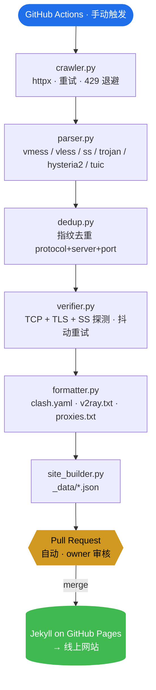

<div align="center">

# FreeNode

### 免费公开节点 / 代理订阅源聚合导航

[](https://weed33834.github.io/freenode/)
[](LICENSE)
[](https://www.python.org/)
[](https://docs.astral.sh/ruff/)
[](tests/)

[English](README.md) · [简体中文](README.zh-CN.md) · [日本語](README.ja.md)

</div>

---

## 项目简介

**FreeNode** 是一个开源的免费公开节点 / 代理订阅源聚合流水线。从 80+ 个社区公开
渠道并发抓取、解析、去重、验证后，输出 Clash / V2Ray / 代理列表三种订阅格式，
并通过 GitHub Pages 导航站对外提供。

- **80+ 数据源**：并发抓取，按可靠性分级调度
- **6 种协议**：`vmess` · `vless` · `ss` · `trojan` · `hysteria2` · `tuic`
- **二段验证**：TCP 连接 + 协议握手（TLS / SS probe）
- **三种输出格式**：`clash.yaml` · `v2ray.txt` · `proxies.txt`
- **手动 PR 流程**：机器人不直接提交 main，每次更新都经 owner 审核
- **零基础设施**：无服务器、无数据库、无 cron —— 纯 GitHub Actions + Pages

> ⚠️ **免责声明**：本项目仅供网络协议学习、安全测试与隐私技术研究。所有节点来自
> 第三方公开渠道，我们不拥有、运营或保证它们。请勿用于银行、支付或任何敏感登录。
> 遵守您所在地的法律。

## 架构



<details>
<summary>ASCII 版（任何地方都能渲染）</summary>

```
GitHub Actions (手动触发)
        │
        ▼
crawler → parser → dedup → verifier → formatter → site_builder
   │                                                  │
   └─ httpx + 重试 + 429 退避              _data/*.json → Jekyll → 网站
```

</details>

## 快速开始

### 使用网站

1. 打开 **<https://weed33834.github.io/freenode/>**
2. 选一种格式（Clash / V2Ray / 代理列表）
3. 点 **复制**，粘贴到客户端订阅里

### 本地运行流水线

```bash
pip install -r requirements.txt
python scripts/update.py --verify    # 跑完整流水线（含验证）
python scripts/site_builder.py       # 生成网站数据
cd docs && jekyll serve --livereload  # 本地预览
```

### 通过 GitHub Actions 更新数据

1. 进 **Actions → Manual Update & PR → Run workflow**
2. 选验证级别（`tcp` 或 `protocol`）
3. 工作流自动创建 PR 到 `auto/pending-update` 分支（不直接 push main）
4. owner 审核 → **合并** → Pages 自动部署

## 配置

所有阈值可通过环境变量配置：

| 变量 | 默认值 | 说明 |
|---|---|---|
| `FREENODE_MAX_NODES` | `800` | 输出最大节点数 |
| `FREENODE_MAX_PROXIES` | `300` | 输出最大代理数 |
| `FREENODE_VERIFY_NODES` | `true` | 是否运行验证 |
| `FREENODE_VERIFY_LEVEL` | `tcp` | `tcp` 或 `protocol` |
| `FREENODE_VERIFY_TIMEOUT` | `5` | 单节点连接超时（秒）|
| `FREENODE_VERIFY_WORKERS` | `50` | 并发验证数 |
| `FREENODE_VERIFY_CAP` | `0` | 验证前截断（0 = 关）|
| `FREENODE_VERIFY_RETRIES` | `2` | 抖动重试次数 |
| `FREENODE_ARCHIVE_RETENTION` | `30` | 快照保留天数 |

## 数据源

所有 80+ 源均来自社区公开渠道。新源先进**观察区**（`status=observing`），
连续 3 天 `reliability > 70%` 才升级为正式启用；连续 7 天低于 30% 降回观察。
详见[数据源目录](https://weed33834.github.io/freenode/sources.html)。

## 文档

- 📖 [关于项目](https://weed33834.github.io/freenode/about.html)
- 📡 [数据源目录](https://weed33834.github.io/freenode/sources.html)
- 🛠️ [协议与客户端指南](https://weed33834.github.io/freenode/guides.html)
- 🔒 [安全策略](SECURITY.md)
- 🤝 [贡献指南](CONTRIBUTING.md)
- 📋 [更新日志](CHANGELOG.md)

## 开发

```bash
make install     # 安装依赖
make test        # 跑 171 个测试
make lint        # ruff 检查（全绿）
make check       # lint + test（推送前跑）
make secrets     # 扫描泄露的密钥
make update      # 跑流水线
```

## License

[MIT](LICENSE) © 2026 badhope

## 链接

- 🌐 **网站**：<https://weed33834.github.io/freenode/>
- 📦 **GitHub**：<https://github.com/weed33834/freenode>
- 📦 **GitCode**：<https://gitcode.com/badhope/freenode>
- 📋 **Issues**：<https://github.com/weed33834/freenode/issues>
