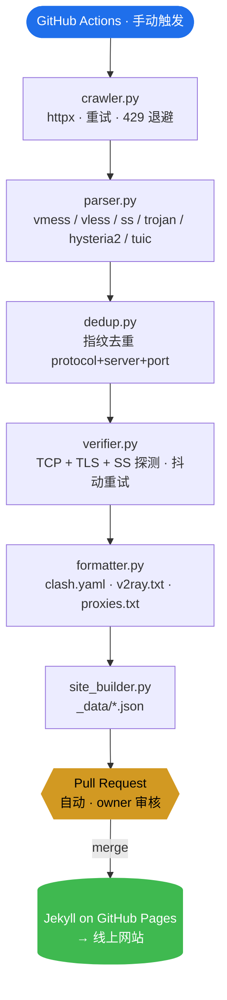

<div align="center">

# FreeNode

### 免费公开代理订阅源聚合流水线 + GitHub Pages 导航站

[](https://weed33834.github.io/freenode/)
[](LICENSE)
[](https://www.python.org/)
[](https://jekyllrb.com/)
[](https://docs.astral.sh/ruff/)
[](tests/)
[](https://weed33834.github.io/freenode/)

**🌐 网站** · **📦 GitHub** · **📦 GitCode**

[English](README.md) | [中文](README.zh.md) | [日本語](README.ja.md)

</div>

---

## 项目简介

**FreeNode** 是一条开源流水线，从 80+ 个社区公开渠道聚合免费公开代理 / 节点订阅源，
经去重与验证后，以 Clash / V2Ray / 代理列表三种格式输出订阅文件，并通过 GitHub Pages
导航站对外提供。

- **80+ 数据源**：并发抓取，按可靠性分级调度
- **6 种协议**：`vmess` · `vless` · `ss` · `trojan` · `hysteria2` · `tuic`
- **二段验证**：TCP 连接 + 协议握手（TLS / SS probe）
- **三种输出格式**：`clash.yaml` · `v2ray.txt` · `proxies.txt`
- **手动 PR 流程**：机器人不直接提交 `main`，每次更新都经 owner 审核
- **零基础设施**：无服务器、无数据库、无 cron —— 纯 GitHub Actions + Pages

> ⚠️ **免责声明**：本项目仅供网络协议学习、安全测试与隐私研究。所有节点均来自第三方
> 公开渠道，我们不拥有、运营或保证它们。请勿用于银行、支付或任何敏感登录。请遵守您
> 所在地的法律。

## 架构



<details>
<summary>ASCII 版（任何地方都能渲染）</summary>

```
┌─────────────────────────────────────────────────────────────────────────┐
│                         GitHub Actions（手动）                          │
└─────────────────────────────────────────────────────────────────────────┘
                                   │
                                   ▼
        ┌──────────────┐    ┌──────────────┐    ┌──────────────┐
        │  crawler.py  │───▶│  parser.py   │───▶│   dedup.py   │
        │  httpx +     │    │  vmess/vless │    │  指纹去重     │
        │  重试 + 429  │    │  ss/trojan/  │    │  protocol+   │
        └──────────────┘    │  hysteria2/  │    │  server+port │
                            │  tuic        │    └──────┬───────┘
                            └──────────────┘           │
                                                       ▼
        ┌──────────────┐    ┌──────────────┐    ┌──────────────┐
        │ site_builder │◀───│ formatter.py │◀───│ verifier.py  │
        │   .py        │    │ clash.yaml   │    │ TCP + TLS +  │
        │ _data/*.json │    │ v2ray.txt    │    │ SS 探测 +    │
        └──────┬───────┘    │ proxies.txt  │    │ 抖动重试     │
               │            └──────────────┘    └──────────────┘
               ▼
    ┌──────────────────┐    ┌────────────────────────────┐
    │  Jekyll on Pages │    │  Pull Request（自动）      │
    │  → 线上网站       │◀───│  owner 审核 → 合并         │
    └──────────────────┘    └────────────────────────────┘
```

</details>

## 快速开始

### 使用网站

1. 打开 **<https://weed33834.github.io/freenode/>**
2. 选择一种格式（Clash / V2Ray / 代理列表）
3. 点击 **复制**，将订阅地址粘贴到客户端

### 本地运行流水线

```bash
# 1. 安装依赖
pip install -r requirements.txt

# 2. 运行完整流水线（含验证）
python scripts/update.py --verify

# 3. 重新生成网站数据
python scripts/site_builder.py

# 4. 本地预览
cd docs && jekyll serve --livereload
```

### 通过 GitHub Actions 更新数据

1. 进入 **Actions → Manual Update & PR → Run workflow**
2. 选择验证级别（`tcp` 或 `protocol`）
3. 工作流创建 PR 到 `auto/pending-update` 分支（不直接 push 到 `main`）
4. owner 审核 → **合并** → Pages 自动部署

> 🔒 **防机器人保护**：`CODEOWNERS` 强制 owner 审核，固定分支名避免分支扩散，
> 7 天未处理的陈旧 PR 自动关闭。

## 项目结构

```
freenode/
├── config/sources.json        # 80+ 数据源定义
├── scripts/
│   ├── crawler.py             # 并发抓取器（httpx、重试、429 退避）
│   ├── parser.py              # 协议链接解析（6 种协议）
│   ├── dedup.py               # 基于指纹的去重
│   ├── verifier.py            # TCP + 协议握手验证
│   ├── formatter.py           # 输出 clash.yaml / v2ray.txt / proxies.txt
│   ├── site_builder.py        # 生成 Jekyll _data/*.json
│   ├── update.py              # 流水线编排（CLI 入口）
│   └── check_secrets.sh       # 推送前密钥泄露扫描
├── docs/                      # Jekyll GitHub Pages 站点
│   ├── _config.yml            # Jekyll 配置
│   ├── _layouts/default.html   # 赛博朋克主题布局
│   ├── _includes/             # 可复用组件
│   ├── _data/                 # 自动生成的 JSON（站点数据）
│   ├── assets/css/style.css  # 赛博朋克设计系统
│   ├── assets/js/main.js     # 搜索、CountUp、汉堡菜单、二维码
│   └── assets/js/qr.js       # 无依赖二维码生成器（约 6KB）
├── nodes/                     # 输出订阅文件
│   ├── clash.yaml
│   ├── v2ray.txt
│   ├── proxies.txt
│   └── quality.json          # 验证统计
├── tests/                     # 171 个通过测试（pytest）
├── .github/
│   ├── workflows/daily-update.yml  # 手动触发工作流
│   ├── CODEOWNERS             # 强制 owner 审核
│   ├── FUNDING.yml            # 赞助配置
│   ├── ISSUE_TEMPLATE/        # Bug / feature 模板
│   └── PULL_REQUEST_TEMPLATE.md
├── CHANGELOG.md               # Keep a Changelog 格式
├── CONTRIBUTING.md            # 贡献指南
├── CODE_OF_CONDUCT.md         # 社区行为准则
├── SECURITY.md                # 漏洞报告
└── LICENSE                    # MIT
```

## 配置

所有阈值均通过环境变量配置（默认值如下）：

| 变量 | 默认值 | 说明 |
|---|---|---|
| `FREENODE_MAX_NODES` | `800` | 输出最大节点数 |
| `FREENODE_MAX_PROXIES` | `300` | 输出最大代理数 |
| `FREENODE_VERIFY_NODES` | `true` | 是否运行验证步骤 |
| `FREENODE_VERIFY_LEVEL` | `tcp` | `tcp` 或 `protocol` |
| `FREENODE_VERIFY_TIMEOUT` | `5` | 单节点连接超时（秒）|
| `FREENODE_VERIFY_WORKERS` | `50` | 并发验证数 |
| `FREENODE_VERIFY_CAP` | `0` | 验证前预截断（0 = 关）|
| `FREENODE_VERIFY_RETRIES` | `2` | 抖动失败重试次数 |
| `FREENODE_ARCHIVE_RETENTION` | `30` | 快照保留天数（0 = 关）|
| `FREENODE_SUSPICIOUS_NETS` | — | 逗号分隔 CIDR 黑名单（蜜罐 / Tor）|
| `FREENODE_GEO_ENABLED` | `false` | 启用 IP 地理位置查询 |

## 数据源

全部 80+ 数据源均为社区公开渠道（GitHub raw 文件、订阅接口、Telegram 频道）。新源
进入**观察模式**（`status=observing`），需连续 3 天 `reliability > 70%` 才能升级为
`active`；连续 7 天低于 30% 降回观察。详见线上[数据源目录](https://weed33834.github.io/freenode/sources.html)。

## 文档

- 📖 [关于项目](https://weed33834.github.io/freenode/about.html)
- 📡 [数据源目录](https://weed33834.github.io/freenode/sources.html)
- 🛠️ [协议与客户端指南](https://weed33834.github.io/freenode/guides.html)
- 🔒 [安全策略](SECURITY.md)
- 🤝 [贡献指南](CONTRIBUTING.md)
- 📋 [更新日志](CHANGELOG.md)

## 支持的协议

| 协议 | 说明 |
|---|---|
| `vmess` | V2Ray VMess，AES/GCM 加密 |
| `vless` | V2Ray VLESS，轻量 XTLS |
| `ss` | Shadowsocks，AEAD 加密 |
| `trojan` | Trojan-GFW，TLS 伪装 |
| `hysteria2` | Hysteria2，基于 QUIC |
| `tuic` | TUIC v5，基于 QUIC |

## 开发

```bash
make install     # 安装依赖
make test        # 运行 171 个测试
make lint        # ruff 检查（全绿）
make check       # lint + test（推送前运行）
make secrets     # 扫描泄露的密钥
make update      # 运行流水线
```

## 许可证

[MIT](LICENSE) © 2026 badhope

## 链接

- 🌐 **网站**：<https://weed33834.github.io/freenode/>
- 📦 **GitHub**：<https://github.com/weed33834/freenode>
- 📦 **GitCode**：<https://gitcode.com/badhope/freenode>
- 📋 **Issues**：<https://github.com/weed33834/freenode/issues>
- 🔒 **安全**：<https://github.com/weed33834/freenode/security/advisories/new>

## Star History

如果 FreeNode 对你有帮助，在 GitHub 点一个 star 有助于其他人发现本项目，也表明对持续
维护的需求。
