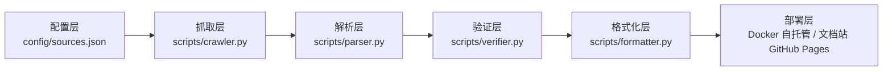
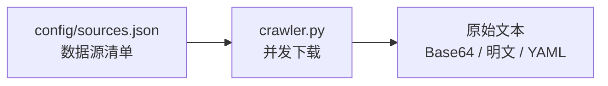
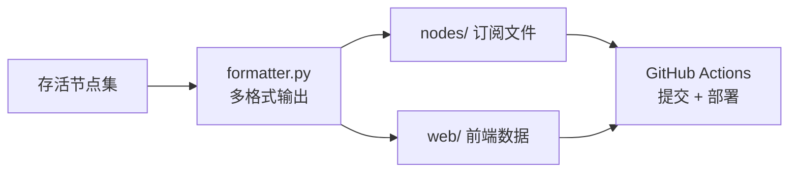

# 项目架构

FreeNode 的核心目标是把互联网上公开、可免费访问的代理与 VPN 节点聚合成统一的订阅格式。整条流水线从数据源到站点发布完全自动化，本地也能一键复现。

## 架构总览



整个流水线每天由 GitHub Actions 触发一次，也可以手动触发或在本地完整复现。从功能视角看，整条链路可归纳为 **数据采集、数据验证、数据发布** 三个阶段：

| 阶段 | 核心模块 | 主要职责 |
|---|---|---|
| 数据采集 | `config/sources.json` + `crawler.py` | 声明并并发拉取所有公开数据源 |
| 数据验证 | `parser.py` + `verifier.py` | 解析链接、去重、TCP 连通性检测 |
| 数据发布 | `formatter.py` + `backend/` + `web/` + `docs-site/` + GitHub Actions | 生成多格式订阅、构建前后端站点并部署文档站 |

下面对每一阶段进行详细说明。

## 各层职责与对应文件

### 1. 配置层

负责声明所有公开数据源及其抓取策略。通过配置文件即可新增、禁用或调整数据源，无需修改代码。

| 文件/目录 | 说明 |
|---|---|
| `config/sources.json` | 数据源清单，分为 `free_node_sources`（节点订阅源）与 `free_proxy_apis`（HTTP(S)/SOCKS4/SOCKS5 代理源） |

每个源对象包含以下关键字段：

- `name`：唯一标识
- `type`：来源类型，如 `github_raw`、`web_url`
- `url`：公开可访问的 URL
- `enabled`：是否启用
- `decode_base64`：内容是否为 Base64 编码
- `protocols`：可能包含的协议列表
- `max_size`：可选的最大下载体积限制

### 2. 抓取层

并发拉取所有启用数据源，处理编码、超时与重试，并做基础的安全校验（仅允许 HTTPS、限制可访问域名）。

| 文件/目录 | 说明 |
|---|---|
| `scripts/crawler.py` | 核心抓取脚本，使用线程池并发拉取；如果系统安装了 curl，会优先用 curl 下载以提升兼容性 |

主要逻辑：

1. 读取 `config/sources.json`，筛选 `enabled: true` 的源。
2. 通过 `_validate_url` 校验协议与域名白名单，防止 SSRF。
3. 使用 `ThreadPoolExecutor` 并发下载，默认并发数 `min(16, enabled_sources)`。
4. 对 Base64 编码的源进行解码。
5. 输出 `{"nodes": [...], "proxies": [...]}` 结构给解析层。

### 3. 解析层

从原始文本中提取标准化的代理链接，并解析成结构化对象。

| 文件/目录 | 说明 |
|---|---|
| `scripts/parser.py` | 提取 `ss://`、`vmess://`、`vless://`、`trojan://`、`hysteria://`、`hysteria2://`、`tuic://` 等链接（`ssr://` 会被识别但跳过不输出） |

主要函数：

- `extract_node_links(text)`：用正则从文本中匹配所有支持的协议链接。
- `decode_vmess(link)`：Base64 解码 vmess 配置。
- `parse_ss_link(link)`：解析 Shadowsocks 链接。
- `parse_vless_link(link)`：解析 VLESS 链接。
- `parse_trojan_link(link)`：解析 Trojan 链接。
- `node_to_clash_config(node)`：将解析后的节点转换为 Clash 配置对象。

### 4. 验证层

对节点进行轻量级 TCP 连通性与延迟检测，过滤掉明显不可用的节点。

| 文件/目录 | 说明 |
|---|---|
| `scripts/verifier.py` | 并发 TCP 检测、可选地域识别、统计存活率与平均延迟 |

主要逻辑：

1. `can_reach_public_internet()`：先检查环境是否能访问公网。
2. `parse_endpoint(link)`：从各类链接中提取 `host:port`。
3. `tcp_check(host, port)`：测量 TCP 连接耗时。
4. `verify_nodes(links, geo_enabled=...)`：使用线程池批量检测。
5. `stats_summary(results)`：计算存活数、存活率、平均延迟与地域分布。

> CI 检查默认不开启验证；每日自动更新工作流默认启用 `--verify`。本地可通过 `FREENODE_VERIFY_NODES=true python3 scripts/update.py --verify` 启用。

### 5. 格式化层

将解析（并可选验证）后的结果输出为三种常用订阅格式。

| 文件/目录 | 说明 |
|---|---|
| `scripts/formatter.py` | 生成 `nodes/clash.yaml`、`nodes/v2ray.txt`、`nodes/proxies.txt` |

输出文件：

| 文件 | 格式 | 用途 |
|---|---|---|
| `nodes/clash.yaml` | Clash 配置（YAML） | Clash Verge、Clash Meta、Stash、Surge 等 |
| `nodes/v2ray.txt` | Base64 编码的链接列表 | v2rayN、v2rayNG、Shadowrocket、NekoBox 等 |
| `nodes/proxies.txt` | 明文 `ip:port` 列表 | 浏览器扩展、爬虫、curl 等 |
| `nodes/regions.json` | 可选的地域统计 | 前端展示用 |

### 6. 部署层

负责通过 Docker 自托管全栈前端站点、将文档站发布到 GitHub Pages，同时维护 GitCode 镜像。

| 文件/目录 | 说明 |
|---|---|
| `.github/workflows/update-nodes.yml` | 手动触发更新流水线（Run workflow） |
| `.github/workflows/ci.yml` | push / PR 时执行 Python 与 Web 检查 |
| `.github/workflows/deploy-docs.yml` | 构建 VitePress 文档站并部署到 GitHub Pages |
| `backend/docker-compose.yml` | Docker 自托管编排（Caddy + FastAPI + Next.js） |
| `web/` | Next.js 前端（服务端渲染，对接后端 API） |
| `docs-site/` | VitePress 文档站 |

部署流程：

1. `update-nodes.yml` 完成节点更新后提交变更。
2. `deploy-docs.yml` 在 `docs-site/` 变更或手动触发时构建 VitePress 文档站，上传并部署到 GitHub Pages。
3. 前端站点（`web/` + `backend/`）通过 `backend/docker-compose.yml` 自托管，由 Caddy 反向代理统一入口并自动签发 HTTPS。

## 三阶段详解

### 第一阶段：数据采集

数据采集阶段负责从互联网上抓取所有公开可用的节点与代理资源。



关键点：

- 所有来源必须在 `config/sources.json` 中显式声明，便于审计。
- `crawler.py` 通过域名白名单、HTTPS 强制与 `max_size` 限制降低 SSRF 与异常流量风险。
- 对 Base64 编码源自动解码，输出统一文本交给解析层。

### 第二阶段：数据验证

数据验证阶段把原始文本变成结构化、可用的节点对象，并过滤明显失效的条目。


关键点：

- `parser.py` 支持 `ss://`、`vmess://`、`vless://`、`trojan://`、`hysteria://`、`hysteria2://`、`tuic://` 以及 HTTP(S)/SOCKS4/SOCKS5 代理链接。
- 解析后先进行 URL 级别去重，避免同一节点多次输出。
- `verifier.py` 通过轻量级 TCP 连接测试 `host:port`，可选开启 GeoIP 地区识别。
- CI 默认不启用验证以加快测试；每日自动更新默认启用 `--verify`。

### 第三阶段：数据发布

数据发布阶段把验证后的节点生成多种客户端可消费的格式，并构建、部署站点。



关键点：

- 输出 `nodes/clash.yaml`、`nodes/v2ray.txt`、`nodes/proxies.txt` 三种主流格式。
- 可选生成 `nodes/regions.json` 供前端做协议/地区统计。
- 文档站由 `deploy-docs.yml` 构建并部署到 GitHub Pages；前端站点（`web/` + `backend/`）通过 Docker 自托管，由 Caddy 提供统一入口与自动 HTTPS。
- GitCode 镜像同步让不同地区用户都能稳定访问。

---

## 目录结构

```
FreeNode/
├── config/
│   └── sources.json              # 配置层
├── scripts/
│   ├── crawler.py                # 抓取层
│   ├── parser.py                 # 解析层
│   ├── verifier.py               # 验证层
│   ├── formatter.py              # 格式化层
│   └── update.py                 # 流水线编排
├── nodes/                        # 格式化层输出
│   ├── clash.yaml
│   ├── v2ray.txt
│   ├── proxies.txt
│   └── regions.json
├── tests/                        # 各层单元测试
│   ├── test_parser.py
│   ├── test_verifier.py
│   └── test_formatter.py
├── backend/                      # 部署层：FastAPI 后端（Docker 自托管）
├── web/                          # 部署层：Next.js 前端（服务端渲染）
├── docs-site/                    # 部署层：VitePress 文档站
└── .github/workflows/            # 部署层：CI/CD
    ├── ci.yml
    ├── update-nodes.yml
    └── deploy-docs.yml
```

## 数据流示例

以下是一次完整的节点更新所经历的数据流：

```text
config/sources.json
       │
       ▼
scripts/crawler.py ──► 并发拉取所有启用源
       │
       ▼
原始文本（Base64 / 明文 / YAML 混合）
       │
       ▼
scripts/parser.py ──► 提取 ss/vmess/vless/trojan 等链接
       │
       ▼
唯一链接列表（去重后数量随数据源波动）
       │
       ▼
scripts/verifier.py ──► TCP 检测，筛选存活节点
       │
       ▼
存活节点 + HTTP(S)/SOCKS4/SOCKS5 代理
       │
       ▼
scripts/formatter.py ──► 生成 clash.yaml / v2ray.txt / proxies.txt
       │
       ▼
nodes/ 输出文件
       │
       ▼
GitHub Actions ──► 提交 nodes/ 变更 + 部署文档站到 GitHub Pages
```

## 扩展建议

- **新增数据源**：只需编辑 `config/sources.json`，无需改动代码。
- **新增协议**：在 `parser.py` 添加链接模式与解析函数，在 `formatter.py` 添加对应的 Clash 类型转换。
- **新增验证方式**：在 `verifier.py` 中实现更复杂的握手检测。
- **新增输出格式**：在 `formatter.py` 中添加新的写入函数。
